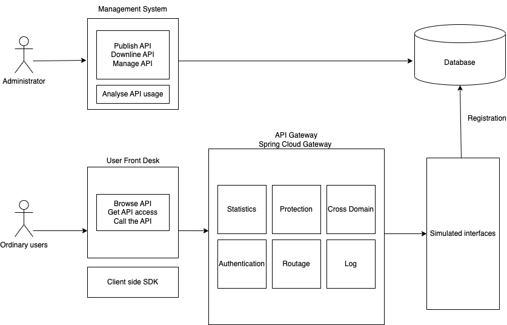

# API open platform

## Tech Stack

### Frontend

- 🌎React 18
- 🐜Ant Design Pro
- 🍚Umi 4
- 🍾Open API

### Backend

- 🌲Java
- 🌿Spring Boot
- 💻MySQL
- 🕊️MyBatis
- 🦅MyBatis X
- 🗝️API Signature Authentication
- 🚴Spring Boot Starter
- 🛞Dubbo RPC
- 🏫Nacos
- 📑Swagger + Knife4j
- ☁️Spring Cloud Gateway
- 📈Echarts
- ⚡️Hutool
- ⌨️Gson

## Introduction

This is a platform to manage APIs and allow users to call them. Our idea originated from the fact that platforms that offer free APIs on the market usually only have documentation and rarely provide direct interfaces for debugging them, while interface debugging platforms like postman do not provide common API resources. Therefore, we wanted to combine the two, to collect some interesting APIs, or provide some useful APIs developed by ourselves, and give their interface documentation and a platform to debug and use them.

In this platform, we have designed two types of users with permissions - administrator and normal user.

Administrator: publish API, downline API, add API, and can count and analyze the API calls.

Ordinary users: register and login, open API calling privileges, and use API.

### System Design

#### How to use

- api-backend: port 7529, backend API management (upload API, downlink API, user login)
- api-gateway: port 8090, API gateway
- api-interface: port 8123, provides various interface services (there can be several interfaces and distributed across servers)
- api-client-sdk: client-sdk, no port, sends requests to port 8090, forwarded by the gateway to the back-end api-interface,  which can be imported by developers with Maven

### Main Functions

- API Access
- Interface Protection
- Interface Authentication
- Counting the number of calls
- Administrators
  - Publish API
  - Manage API
  - Downline API
  - Analyse API usage
  - Modify API

- Ordinary users
  - Get access to API
  - Invoke API
  - Browse API

### Tech Points

- According to the business process, the whole project backend is divided into 5 sub-projects: web system, mock interface, public module, client SDK, API gateway, and use Maven for multi-module dependency management and packaging.
- To prevent the interface from being called maliciously, we designed API signature authentication algorithm and assigned a unique accessKey / secretKey to the user for authentication to ensure the security and traceability of the call.
- Spring Cloud Gateway is chosen as the API gateway to achieve route forwarding, access control, traffic staining, and centralized processing of business logic such as signature verification, request parameter verification, and interface call statistics, which improves security and facilitates system development and maintenance at the same time.
- To solve the problem of code duplication within multiple subsystems, we abstracted the model layer and business layer code as common modules, and used the Dubbo RPC framework to achieve high-performance interface calls between subsystems, significantly reducing duplicate code.
- We have used Spring AOP technology to make the login authentication required for different user operations a public module.
- To solve the problem of high call cost for developers, we have developed a client SDK based on Spring Boot Starter to improve the development experience.
- For the back-end, we use Swagger + Knife4j to automatically generate the interface documentation for the OpenAPI specification, and for the frontend we use plugins to automatically generate the interface request code to reduce the cost of frontend and backend collaboration.

# TODO List

- [x] Front-end and Back-end project initialization  
  - Front-end Ant Design Pro framework
  - Back-end Spring Boot
- [x] Database table design 
- [x] Login Page development
- [x] Interface management function development
- [x] Mock API interface development
- [x] HTTP interface call development
- [x] API signature authentication development
- [x] Client SDK development (Spring Boot Starter)

- [x] Administrator interface publishing / downline function development
- [x] Interface list page development
- [x] Online debugging interface function development
- [x] Interface invoke statistics development
- [x] Spring Cloud Gateway implementation
- [x] Transforming to distributed system
- [x] Administrator statistical analysis function development
- [ ] Collecting and pubulishing real APIs
- [ ] User registration interface development
- [ ] Transform the interface of the invoking APIs into a different interface for post requests and get requests